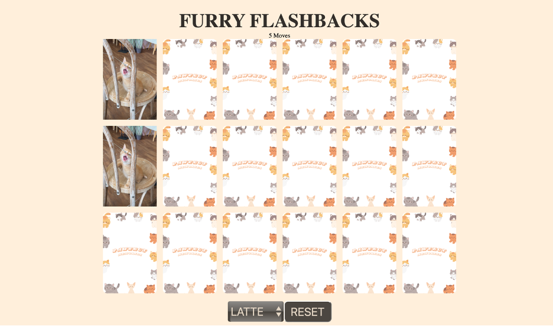

# FURRY FLASHBACKS MEMORY GAME

This is a simple memory card game implemented using HTML, CSS, and JavaScript. Player gets to choose between two cats – Koffee and Latte. Your mission is to flip the cards and seek matching images. Successful pairs stay face-up, and you aim to complete the challenge in under 30 moves to win. Be strategic, match images, and enjoy the thrill of Furry Flashbacks!
Refer to rules.txt for more detailed explanation on how to play the game.

 

## [PLAY HERE](https://meikeetan.github.io/Furry-Flashbacks/)

 

## CODE EXPLANATION: 

The code is split into five files: 

1)	 catPhotos folder
- To store all my cat images in png.

2)	 data folder 
- Consists of two JSON files, koffee.json and latte.json. 
- It contains an array of objects, where each object represents a card for a memory matching game. 
- The purpose of these JSON files is to store data related to the game cards, specifically the image file path and the name associated with each card for card comparison later.
- For example, for the koffee.json file:
Each object in the array represents a card with two key-value pairs:
- "image": Specifies the relative path to the image file associated with the card.
- "name": Represents a unique identifier or name for the card.

3)	 index.html 
- This file contains the basic structure of the HTML page. 
- It has a header element with to contain the title FURRY FLASHBACKS and id moveCount to display the number of moves.
- It has another div element with class=“mainboard” to display the main game board. This is just a placeholder to display the cards once they are generated from javascript. 
- It has another div element with class=“actions” to hold the select tag and reset button.
- It has another div element with id winLoseAlert to display win or lose message at the end of the game. 
- The CSS and JavaScript files are also linked in this file. 

4)	 style.css
- This file has the styling for the header, main board, action buttons (i.e. the select tag and reset button) and the win or lose display message. 
- Each card has a fixed width and height. 
- The background and text colors are also defined here.

5)	 script.js
#### Variables Initialization

const mainboard: 
- Represents game board to append the cards into this div when they are generated.
 
 
const resetButton: 
- Represents reset button on the user interface, and so that I can add event listeners later on
 
 
const winLoseAlert: 
- Represents an element to display win/lose messages, which will be modified depending on the result of the game.
 
 
const initialCatType: 
- Specifies the default cat type.
 
 
cards: 
- An array to hold all cards.
 
 
firstCard, secondCard: 
- Variables with no initial value, will be used later for card comparison.
 
 
lockBoard: 
- Disables clicking of cards during certain events.
 
 
moveCount: 
- Tracks the number of moves made by the player.
 
 
catTypeSelector: 
- Represents the dropdown for selecting cat types.

#### Event Listeners 
- Reset button has an event listener that waits for “click”, and runs resetGame function.
- catTypeSelector has an event listener that listen for “change” event and run the fetchData function based on the cat type selected.
- The cards have an event listener that will run the flipCard function when clicked. 

#### Setting Move Count
document.getElementById("moveCount").textContent = moveCount;

#### Functions
resetBoard() : 
- Resets the `firstCard`, `secondCard` and `lockBoard` variables. 
 
 
generateCards() : 
- Dynamically creates HTML elements for each card based on the data fetched.
- Appends these elements to the game board (`mainBoard`).
- Adds a click event listener (`flipCard`) to each card.
 
 
shuffleCards() :
- Uses the Fisher-Yates algorithm to shuffle the cards array randomly.
 
 
resetGame() :
- Calls `resetBoard` to clear card-related variables.
- Shuffles the cards.
- Resets the move count.
- Clears the game board (`mainBoard`). 
- Generates new cards.
- Hides the win/lose alert.
 
 
fetchData() :
- Fetches card information from a JSON file based on the selected cat type.
- Creates pairs of cards by duplicating the data.
- Calls `resetGame` to initialize the game.
 
 
unflipCards() : 
- Uses `setTimeout` to wait for 1 second before removing the flipped class.
- Calls `resetBoard` if the move count is less than 30.
 
 
disableCards() : 
- Removes the click event listener from the first and second cards.
- Calls `resetBoard` if the move count is less than 30.
 
 
checkForMatch() :
- Compares the data-name attribute of the first and second cards to check if they match.
- Calls `disableCards` if there's a match, otherwise calls `unflipCards`.
 
 
winGame() :
- Checks if all cards are flipped.
- Displays a win message and locks the board if the condition is met.
 
 
winOrLose() : 
- Calls `winGame`.
- Displays GAMEOVER and locks the board if the move count exceeds 30.
 
 
flipCard() : 
- Flips the clicked card.
- Tracks the first and second cards for comparison.
- Increase the move count.
- Calls `checkForMatch`, `winOrLose`, and sets `lockBoard` to true.

 

## POSSIBLE FUTURE ENHANCEMENTS

Timer
- Add a timer to track the time it takes for the player to complete the game. 
- Challenge player to finish the game within a certain time limit.

Score System
- Introduce a scoring system based on the number of moves or time taken. 
- Display player's score at the end of the game.

Sound Effects and Music
 

